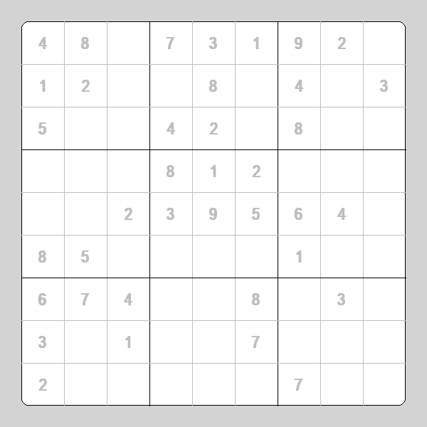

# Impossible Sudoku Generator

Generates a sudoku table with no possible solution.

## Installation

### Windows

Type the following commands in the windows terminal:

```bash
pip install -r requirements.txt
```

```bash
python main.py
```

## Usage

Fill in each cell a number between 1 to 9; each row, column and 3x3 chunk must contain every number from 1 to 9.

Although in the beginning multiple cells can be filled without any problem, eventually the game will halt into an impossible state, which one or more cells can not be filled even though the 9x9 grid follows the before-mentioned rules.

Nevertheless, have fun filling in as much as you can!

Also, the program will output a png image with the initial state, if by any case you want to solve it by hand.

## Example


